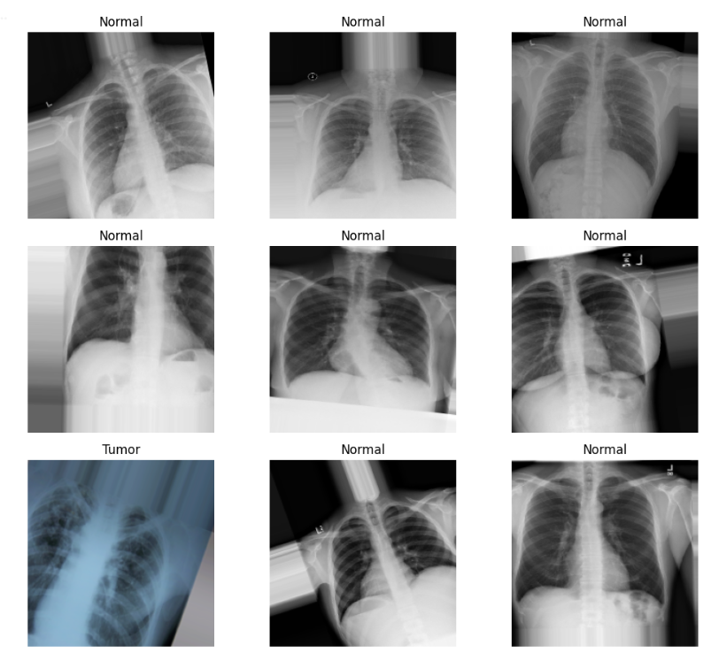

# Tuberculosis Detection Using Deep Learning

This project focuses on detecting Tuberculosis (TB) from chest X-ray images using a deep learning model. The idea was to build something practical that can support early diagnosis using image classification techniques.

---

## Project Preview

---

## Demo Video

[▶ Watch Project Demo](https://youtu.be/hHlS5qtTmLw)

---

## What this project is about

Tuberculosis is still a serious health issue, and early detection can make a big difference.

In this project, I trained a deep learning model that looks at chest X-ray images and predicts whether the patient is **TB positive or normal**.

The goal was to understand how medical image classification works and how deep learning can be used in real-world healthcare problems.

---

##  What I did in this project

- Collected and prepared chest X-ray image data  
- Applied preprocessing and augmentation to improve training  
- Built a CNN-based deep learning model , resnet and densenet
- Trained and evaluated the model on test data  
- Tested predictions on unseen images  

---

## Tech Stack

- Python  
- TensorFlow / Keras   
- Matplotlib  

---

## Model Output

The model classifies images into:

- TB Positive  
- Normal  

---

## Things I’d like to improve next

- Try transfer learning (like ResNet or EfficientNet)  
- Improve accuracy with more data  
- Add Grad-CAM to visualize predictions  
- Deploy it as a simple web app  

---

## Final Note

This was a good learning project for me in medical AI and deep learning. It helped me understand how image classification models can be applied in healthcare use cases.

---

## Contact

If you have any feedback or ideas, feel free to reach out.
